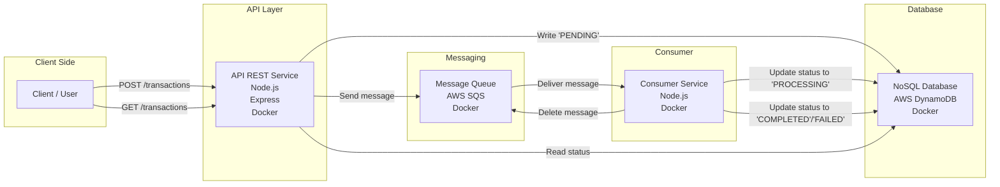
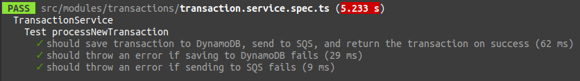

# Desafio Técnico Liqi: Sistema de Processamento de Transações Financeiras

## 1. Introdução

Este projeto é uma implementação para o desafio técnico da Liqi para a posição de Desenvolvedor Backend Pleno. O objetivo é criar um sistema simplificado para processamento de transações financeiras utilizando arquitetura orientada a eventos com Node.js, TypeScript e simulações de serviços AWS (SQS e DynamoDB) rodando localmente com Docker.

## 2. Funcionalidades Principais

- **API REST:** Para recebimento e consulta de transações.
  - `POST /api/v1/transactions`: Recebe novas transações.
  - `GET /api/v1/transactions/:id`: Consulta transação por ID.
  - `GET /api/v1/transactions`: Consulta transações por período (opcionalmente com `startDate` e `endDate`).
  - `GET /api/v1/transactions/:id/status`: Consulta status da transação.
  - `GET /health`: Verifica a saúde da API.
- **Processamento Assíncrono:** Novas transações são enviadas para uma fila (ElasticMQ simulando SQS) e processadas por um consumidor separado.
- **Persistência:** Transações são armazenadas em um banco de dados NoSQL (DynamoDB Local).
- **Validação:** O consumidor realiza validações básicas na estrutura dos dados da transação.
- **Consultas Eficientes:** Utiliza um Índice Secundário Global (GSI) no DynamoDB para otimizar a consulta por período.
- **Documentação da API:** Documentação interativa disponível via Swagger UI.
- **Containerização:** Aplicação e serviços (DB, Fila) rodam em containers Docker gerenciados pelo Docker Compose.
- **Testes:** Configuração de testes unitários com Jest.

## 3. Tecnologias Utilizadas

- **Backend:** Node.js (v18+ recomendado)
- **Linguagem:** TypeScript
- **Framework:** Express.js
- **Banco de Dados:** AWS DynamoDB (simulado com `amazon/dynamodb-local`)
- **Fila:** AWS SQS (simulado com `softwaremill/elasticmq`)
- **Containerização:** Docker, Docker Compose
- **Testes:** Jest, ts-jest, Supertest (para testes de API futuros)
- **Documentação API:** Swagger UI, swagger-jsdoc
- **Variáveis de Ambiente:** dotenv
- **Outros:** Nodemon/ts-node-dev (desenvolvimento), Rimraf, ESLint/Prettier (recomendado)

## 4. Arquitetura

A arquitetura segue um padrão orientado a eventos:

1. O **Cliente** envia uma requisição HTTP para a **API REST** (Express).
2. A **API REST** valida a entrada, salva um registro inicial no **DynamoDB** com status `pending` e envia uma mensagem contendo os detalhes da transação para a **Fila (ElasticMQ/SQS)**.
3. A **API REST** retorna uma resposta para o Cliente.
4. O **Serviço Consumidor** (rodando separadamente ou no mesmo processo da API) monitora a Fila.
5. Ao receber uma mensagem, o **Consumidor** atualiza o status no **DynamoDB** para `processing`.
6. O **Consumidor** realiza validações.
7. O **Consumidor** atualiza o status final no **DynamoDB** (`completed` ou `failed`).
8. O **Consumidor** remove a mensagem da Fila.
9. Consultas (`GET`) na **API REST** leem diretamente do **DynamoDB**.



## 5. Pré-requisitos

- Docker: [https://docs.docker.com/get-docker/](https://docs.docker.com/get-docker/)
- Docker Compose: (Geralmente incluído na instalação do Docker Desktop) [https://docs.docker.com/compose/install/](https://docs.docker.com/compose/install/)
- Node.js e npm: Necessários para instalar dependências e rodar comandos localmente (como a AWS CLI para setup do DB). [https://nodejs.org/](https://nodejs.org/)
- AWS CLI (Opcional, mas recomendado para setup do DB): [https://aws.amazon.com/cli/](https://aws.amazon.com/cli/)

  - Configure a AWS CLI com credenciais para uso local (ou use as credenciais do `.env`):

    ```bash
    aws configure --profile localstack # Ou outro nome de profile
    # AWS Access Key ID [None]: fakeMyKeyId
    # AWS Secret Access Key [None]: fakeMySecretAccessKey
    # Default region name [None]: us-east-1
    # Default output format [None]: json
    ```

## 6. Configuração

1. **Clone o Repositório:**

   ```bash
   git clone git@github.com:gabrielrodriguesleite/LiqiTransactions.git
   cd LiqiTransactions
   ```

2. **Variáveis de Ambiente:**

   - Copie o arquivo de exemplo `env_example` para um novo arquivo chamado `.env`.

     ```bash
     cp env_example .env
     ```

   - Revise as variáveis no `.env`. Os valores padrão devem funcionar para o ambiente Docker Compose local.
     - `PORT`: Porta da API (padrão 3000)
     - `AWS_REGION`, `AWS_ACCESS_KEY_ID`, `AWS_SECRET_ACCESS_KEY`: Credenciais (falsas) e região para os clientes AWS SDK se conectarem aos simuladores locais.
     - `DYNAMODB_ENDPOINT`: URL do container DynamoDB Local (ex: `http://dynamodb-local:8000`).
     - `DYNAMODB_TABLE_NAME`: Nome da tabela DynamoDB (ex: `Transactions`).
     - `SQS_ENDPOINT`: URL base do container ElasticMQ (ex: `http://elasticmq:9324`).
     - `SQS_QUEUE_URL`: URL completa da fila no ElasticMQ (ex: `http://elasticmq:9324/000000000000/transaction-queue`).

## 7. Executando a Aplicação (Docker Compose)

1. **Construir e Iniciar os Containers:**

   - No terminal, na raiz do projeto, execute:

     ```bash
     docker-compose up --build
     ```

   - Para rodar em background (detached mode):

     ```bash
     docker-compose up --build -d
     ```

   - Isso iniciará:
     - O serviço da API (`app`) na porta definida (ex: 3000).
     - O serviço DynamoDB Local (`dynamodb-local`) na porta 8000.
     - O serviço ElasticMQ (`elasticmq`) na porta 9324 (API) e 9325 (UI Web).

2. **Setup Inicial do Banco de Dados:**

   - O DynamoDB Local inicia com o banco de dados vazio (a menos que dados persistidos existam no volume `dynamodata`). Você precisa criar a tabela `Transactions` **uma vez**.
   - Abra **outro terminal** e execute o comando da AWS CLI (ajuste `--table-name` se você mudou no `.env`):

     ```bash
     aws dynamodb create-table \
         --table-name Transactions \
         --attribute-definitions AttributeName=id,AttributeType=S \
         --key-schema AttributeName=id,KeyType=HASH \
         --provisioned-throughput ReadCapacityUnits=5,WriteCapacityUnits=5 \
         --endpoint-url http://localhost:8000 --profile localstack # Use o profile configurado ou remova se usar credenciais padrão/env vars
     ```

   - **Adicionar o GSI (TimestampIndex):** Execute também o comando para adicionar o índice secundário (necessário para consulta por período eficiente):

     ```bash
     aws dynamodb update-table \
         --table-name Transactions \
         --attribute-definitions \
             AttributeName=gsi1pk,AttributeType=S \
             AttributeName=timestamp,AttributeType=S \
         --global-secondary-index-updates "[{\"Create\":{\"IndexName\":\"TimestampIndex\",\"KeySchema\":[{\"AttributeName\":\"gsi1pk\",\"KeyType\":\"HASH\"},{\"AttributeName\":\"timestamp\",\"KeyType\":\"RANGE\"}],\"Projection\":{\"ProjectionType\":\"ALL\"},\"ProvisionedThroughput\":{\"ReadCapacityUnits\":5,\"WriteCapacityUnits\":5}}}]" \
         --endpoint-url http://localhost:8000 --profile localstack # Use o profile configurado
     ```

     _(Se a tabela ou índice já existirem, esses comandos darão erro, o que é normal)._

   - **Outra forma é utilizando o container app**:

      Em um novo terminal inicie o `sh` dentro do container app e instale o `aws-cli`

      ```bash
      docker-compose run app sh
      apk add aws-cli
      ```

      Execute este comando no terminal para criar a tabela no dynamoDB:

      ```bash
      aws dynamodb create-table \
      --table-name Transactions \
      --attribute-definitions \
          AttributeName=id,AttributeType=S \
      --key-schema \
          AttributeName=id,KeyType=HASH \
      --provisioned-throughput \
          ReadCapacityUnits=5,WriteCapacityUnits=5 \
      --endpoint-url http://dynamodb-local:8000
      ```

      Execute este comando no terminal para atualizar a tabela no dynamoDB:

      ```bash 
      aws dynamodb update-table \
      --table-name Transactions \
      --attribute-definitions \
          AttributeName=gsi1pk,AttributeType=S \
          AttributeName=timestamp,AttributeType=S \
      --global-secondary-index-updates \
          "[
              {
                  \"Create\": {
                      \"IndexName\": \"TimestampIndex\",
                      \"KeySchema\": [
                          {\"AttributeName\": \"gsi1pk\", \"KeyType\": \"HASH\"},
                          {\"AttributeName\": \"timestamp\", \"KeyType\": \"RANGE\"}
                      ],
                      \"Projection\": {
                          \"ProjectionType\": \"ALL\"
                      },
                      \"ProvisionedThroughput\": {
                          \"ReadCapacityUnits\": 5,
                          \"WriteCapacityUnits\": 5
                      }
                  }
              }
          ]" \
      --endpoint-url http://dynamodb-local:8000
      ```

3. **Executar o Consumidor SQS:**
   O consumidor inicia automaticamente por estar definido no `docker-compose` então não precisa ser iniciado manualmente.
   Entretando é possível iniciá-lo manualmente:

   - Abra **outro terminal** (ou use uma aba diferente), entre no container da aplicação e inicie o consumidor:

     ```bash
     docker-compose exec app sh
     # Dentro do container:
     npm run start:consumer
     ```

## 8. Usando a API

- **Documentação Interativa (Swagger UI):**
  - Acesse <http://localhost:3000/api-docs> no seu navegador.
  - Ou veja um print da [documentação interativa.](./assets/Swagger-UI-real.png)
- **Endpoints Principais:**
  - `POST /api/v1/transactions` (Body: `{ "value": 10.5, "type": "credit", "destination": "conta-1" }`)
  - `GET /api/v1/transactions/<transaction_id>`
  - `GET /api/v1/transactions` (Opcional: `?startDate=YYYY-MM-DD&endDate=YYYY-MM-DD`)
  - `GET /api/v1/transactions/<transaction_id>/status`
- **Exemplos com `curl`:**

  ```bash
  # Criar Transação
  curl -X POST http://localhost:3000/api/v1/transactions \
  -H "Content-Type: application/json" \
  -d '{"value": 55.20, "type": "debit", "origin": "conta-origem-xyz"}'

  # Consultar (substitua <ID>)
  curl http://localhost:3000/api/v1/transactions/<ID>

  # Consultar Status (substitua <ID>)
  curl http://localhost:3000/api/v1/transactions/<ID>/status

  # Consultar por período
  curl "http://localhost:3000/api/v1/transactions?startDate=2025-04-01&endDate=2025-04-04"
  ```

## 9. Executando Testes

- Para rodar os testes unitários (com Jest):

  ```bash
  # Executar dentro do container app
  docker-compose exec app npm test

  # Ou para modo watch
  docker-compose exec app npm run test:watch
  ```

  
  

## 10. Estrutura do Projeto (Visão Geral)

```
├── Dockerfile                  # Define a imagem Docker da aplicação
├── docker-compose.yml          # Orquestra os containers (app, db, queue)
├── elasticmq.conf              # Configuração da fila local (ElasticMQ)
├── package.json                # Dependências e scripts Node.js
├── tsconfig.json               # Configuração do TypeScript
├── jest.config.js              # Configuração do Jest
├── env_example                 # Exemplo de variáveis de ambiente
├── .env                        # Variáveis de ambiente locais (não versionado)
├── assets/                     # Contém arquivos utilizados na documentação
├── src/                        # Código fonte da aplicação
│   ├── app.ts                  # Configuração principal do Express, Swagger, middlewares
│   ├── server.ts               # Inicialização do servidor HTTP
│   ├── consumer.ts             # Lógica do consumidor da fila SQS
│   ├── config/                 # Configurações (clientes SQS, DynamoDB)
│   ├── modules/                # Módulos de negócio (ex: transactions)
│   │   └── transactions/       # Módulo de Transações
│   │       ├── *.routes.ts     # Definição das rotas Express
│   │       ├── *.controller.ts # Controladores (lógica HTTP)
│   │       ├── *.service.ts    # Lógica de negócio, interação com DB/Fila
│   │       ├── *.dto.ts        # Data Transfer Objects (corpos de requisição/resposta)
│   │       └── *.interface.ts  # Interfaces TypeScript (modelo de dados)
│   ├── tests/                  # Arquivos e configurações de teste
├── dist/                       # Código JavaScript compilado (gerado pelo build)
└── README.md                   # Este arquivo
```

## 11. TODO / Próximos Passos

- Implementar testes de integração.
- Implementar mecanismo de Retry no consumidor SQS.
- Configurar Dead Letter Queue (DLQ) para falhas persistentes.
- Adicionar monitoramento básico (métricas).
- Melhorar tratamento de erros (middleware centralizado).
- Refatorar para usar Injeção de Dependência.
- Preparar para deploy na AWS (ex: usando AWS SAM).
